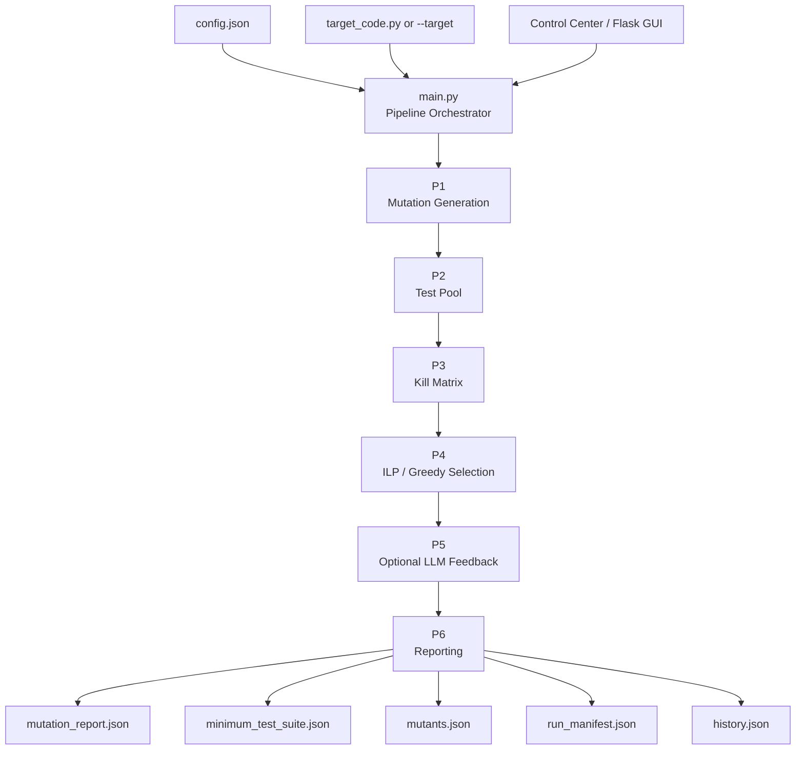
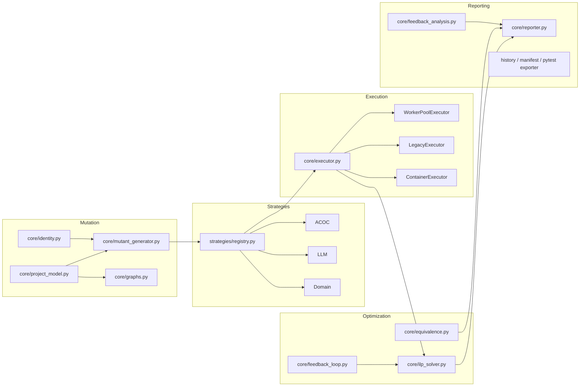

<div align="center">

# Mutation Framework

### LLM-Assisted Mutation Testing with Automated Test-Suite Minimization

AST-based mutation generation · configurable test strategies · sandboxed execution · kill-matrix analysis · ILP/greedy suite selection · optional LLM feedback

</div>

---

## Overview

**Mutation Framework** is a Python mutation-testing pipeline for a configured target program.
It generates source-code mutants, builds a candidate test pool, executes the original program
and mutants, constructs a test × mutant kill matrix, selects a compact covering test suite,
and writes structured JSON results.

The implementation is deliberately modular. The main pipeline is split into six phases:

```text
P1  Generate mutants
 ↓
P2  Build test pool
 ↓
P3  Execute tests + build kill matrix
 ↓
P4  Select a minimum covering suite
 ↓
P5  Optional LLM-targeted feedback / additional tests
 ↓
P6  Write reports, manifest, and analysis artifacts
```

The current repository includes a sample target containing `bubble_sort` and `binary_search`,
plus configuration, execution backends, test-generation strategies, reporting, a browser control
center, and regression/integration test code.

> **Documentation policy:** this README describes behavior that is present in the repository.
> Recorded results are labeled as recorded artifacts; they are not presented as freshly reproduced
> measurements unless explicitly stated.

---

## What the code actually implements

| Area | Implementation in this repository |
|---|---|
| Target analysis | Python `ast` parsing and mutation over a configured target file |
| Mutation categories | Arithmetic, relational, logical (supported), and integration operators |
| Integration operators | `IPVR`, `IUOI`, `IORC`, `ISMA`, `IMCD` |
| Test generation | ACOC + LLM + Domain strategies, ordered and deduplicated |
| Execution | Warm worker pool by default; legacy and container backends available |
| Isolation | Fresh execution namespace per job; timeouts; process/resource controls in supported environments |
| Optimization | PuLP/CBC ILP; greedy set-cover fallback |
| LLM | Optional Anthropic Messages API client; disabled by default in `config.json` |
| Feedback | Optional bounded LLM feedback loop driven by surviving mutants |
| Equivalence | Advisory AST identity-folding analysis; does not alter V1 scoring |
| Project model | Optional project-root AST discovery, symbol table, import graph, best-effort call graph |
| Reporting | `mutation_report.json`, `minimum_test_suite.json`, `mutants.json`, `run_manifest.json`, `history.json` |
| GUI | Standard-library control center + Flask GUI |
| Reproducibility | Environment envelope + fixed ACOC seed (`42`) |
| Pytest export | Export selected suite from `minimum_test_suite.json` |

---

## Architecture



### Internal modules



---

## Phase 1 — Mutation generation

`core/mutant_generator.py` parses the target with Python's AST module and creates
`MutantRecord` objects in memory.

### Standard mutation categories

**Arithmetic (`ARITH`)** supports configured replacements among arithmetic operators used by the
mutation map, including `+`, `-`, `*`, `/`, `//`, and `%`.

**Relational (`REL`)** supports changes among operators such as `<`, `>`, `<=`, `>=`, `==`, `!=`,
`is`, and `is not` where the corresponding AST operator is present.

**Logical (`LOGICAL`)** supports `and ↔ or`. The capability exists in the engine, while the
bundled default configuration has logical mutation disabled.

### Integration operators

The implementation contains five integration-level transformations:

| ID | Transformation implemented in code |
|---|---|
| `IPVR` | `range(n)` → `range(n-1)` |
| `IUOI` | `if/while cond` → `if/while not cond` |
| `IORC` | comparison operands `a op b` → `b op a` |
| `ISMA` | subscript index `arr[i]` → `arr[i+1]` |
| `IMCD` | `len(x)` → `0` |

Mutants are validated by parsing the generated source and comparing canonicalized AST/source
representations. Stable content-based identities are also available through `core/identity.py`
using SHA-256 over semantic mutant fields and the generated mutant code.

---

## Phase 2 — Test-pool construction

`core/test_pool_builder.py` obtains enabled strategies from `strategies/registry.py`.
The default order is deterministic:

```text
ACOC → LLM → Domain
```

The merged pool is deduplicated before execution.

### ACOC strategy

`strategies/acoc_strategy.py` builds cases from configured parameter partitions. The default
configuration limits the number of generated tests per function with:

```json
"acoc_max_per_function": 200
```

The strategy uses a fixed seed of **42**, captured in the reproducibility envelope.

### Domain strategy

`strategies/domain_strategy.py` contributes function/type-oriented cases using the configured
function and parameter types.

### LLM strategy

`strategies/llm_strategy.py` can add targeted inputs when LLM generation is enabled. The default
repository configuration sets:

```json
"llm_enabled": false
```

---

## Phase 3 — Execution and kill matrix

`core/sandbox_executor.py` evaluates candidate tests against the target and mutants and produces a
matrix with shape:

```text
[n_tests × n_mutants]
```

A cell is based on the execution result of the mutant versus the recorded result of the original
program for the same test.

### Default backend: warm worker pool

The default `sandbox.execution_backend` is `pool`.

The pool uses long-lived spawned worker processes. Each job executes the supplied target code in
a fresh namespace, so state is not intentionally shared from one job to another. The parent process
owns the per-job wall-timeout and can recycle a worker after timeout/crash conditions. Results are
keyed by job ID, so completion order does not determine matrix placement.

On Linux/Darwin the pool also attempts process resource limits, including an address-space cap;
platforms that do not expose those limits rely on the implemented wall-timeout behavior.

### Available execution backends

The executor factory in `core/executor.py` recognizes:

| Value | Meaning |
|---|---|
| `pool` / `workerpool` | Default warm worker-pool implementation |
| `legacy` | Per-job spawned execution through `run_safe` |
| `container` | Docker/Podman isolated execution |

The container backend is not silently substituted when a runtime is missing. It raises a clear
error instead of downgrading to another backend.

When selected, the container command constructed by `core/container_executor.py` includes settings
such as:

```text
--network none
--read-only
--tmpfs /tmp:rw,size=64m
--memory <configured limit>
--pids-limit <configured limit>
--cpus 1
```

The host also enforces a per-job timeout and can kill the container on timeout.

---

## Phase 4 — Minimum test-suite selection

`core/ilp_solver.py` converts the kill matrix into a set-cover-style binary optimization problem.
The objective is to minimize the number of selected tests while covering all mutants that are
killable by at least one candidate test.

With PuLP available, the solver uses CBC and a configurable solver timeout. When the ILP path is
unavailable or does not reach an optimal status, the code falls back to a greedy set-cover method.

### Mutant status semantics

The solver distinguishes:

- **KILLED** — covered by at least one selected test.
- **SUSPECTED** — no candidate test in the current matrix kills the mutant.
- **ALIVE** — a coverable mutant exists but is not killed by the selected suite.

A `SUSPECTED` mutant is **not automatically an equivalent mutant**. Equivalence is analyzed later
as an advisory, separate step.

### Scores

The reporter writes both:

```text
raw_score      = killed / total × 100
adjusted_score = killed / (total − suspected) × 100
```

The adjusted score therefore excludes `SUSPECTED` mutants from its denominator. It must not be
interpreted as proof that every generated mutant was directly killed.

---

## Phase 5 — Optional LLM feedback loop

The feedback phase runs only when an actual LLM client is active and the current adjusted score is
below `optimizer.target_score`.

The configuration bounds the loop with parameters including:

```json
"feedback_max_rounds": 3,
"feedback_max_mutants_per_round": 10,
"feedback_max_new_tests_per_mutant": 2,
"feedback_failed_inputs_in_prompt": 3
```

The loop can request additional targeted tests for surviving mutants, extend the kill matrix, and
re-solve the suite-selection problem.

The LLM path is optional. A normal `--no-llm` run uses an offline dummy client and makes no API
request.

---

## Advisory analysis layers

### Equivalent-mutant analysis

`core/equivalence.py` runs a conservative AST identity-folding pass over surviving (`SUSPECTED`)
mutants. It looks for structurally unchanged code after recognized value-preserving identities such
as `x * 1`, `x + 0`, `x / 1`, and related boolean identities.

This analysis is explicitly **advisory**. It does not modify the main mutation score or mutant
status used by the core V1 reporting path.

### Survivor feedback analysis

`core/feedback_analysis.py` is a deterministic, read-only heuristic layer. It turns surviving
mutants into structured observations and suggestions, such as boundary-oriented test ideas for
relational mutations.

It does not execute code, call the LLM, or modify pipeline state.

---

## Optional project model and graphs

`core/project_model.py` can build a queryable AST model for either:

1. a configured `project.root`, where Python modules are discovered under the root, or
2. the default single-file target configuration, where the model contains one module.

The model exposes module information, symbols, `qualified_name_at`, an import graph, and a
best-effort static call graph.

The call graph is intentionally documented as **best effort**: dynamic Python features can prevent
sound static resolution, so unresolved calls are recorded rather than guessed.

> The current main execution path still mutates and executes the configured target source file.
> The project model is used for inspection/attribution; it should not be read as a claim that the
> pipeline automatically performs whole-project mutation testing across every discovered module.

---

## LLM integration

`llm/client.py` is the single API client in the repository. It uses Python's standard `urllib`
stack to call the Anthropic Messages API.

The configured model in the bundled `config.json` is:

```text
claude-sonnet-4-6
```

The API key is read from:

```text
ANTHROPIC_API_KEY
```

The client implements:

- retry handling for HTTP 429 and server-side 5xx responses,
- exponential backoff for rate limits,
- a circuit breaker after repeated failures,
- fail-fast behavior while the circuit remains open.

LLM usage is **opt-in** in the bundled configuration.

---

## Quick start

### Requirements

- Python **3.10+**
- `pulp` for ILP selection (declared as a project dependency)
- `pytest` for the included test suite (development extra)
- Optional: Flask for `gui.py`
- Optional: Docker or Podman for `sandbox.execution_backend = "container"`

### Install

```bash
git clone <repository-url>
cd <repository-directory>
python -m venv .venv
```

Activate the environment and install:

```bash
python -m pip install -e .
```

Development/testing tools:

```bash
python -m pip install -e ".[dev]"
```

Optional coverage tooling:

```bash
python -m pip install -e ".[coverage]"
```

### Run the bundled target without LLM calls

```bash
python main.py --no-llm
```

### Useful CLI options

```text
--config CONFIG    configuration file (default: config.json)
--no-llm           disable all LLM calls
--verbose          verbose phase logging
--json-logs        structured JSON log lines
--workers N        override Phase-3 worker count
--target FILE      override the configured target file
```

The `--target` option belongs to the root `main.py` parser. The installed console entry point in
`pyproject.toml` targets `cli.main:main`; that parser currently exposes the common options but does
not define `--target`. For target-file overrides, use `python main.py --target ...`.

### Installed console command

For the configured target, the packaged entry point is:

```bash
mutation-framework --no-llm
```

---

## Configuration

The bundled `config.json` contains these top-level sections:

```text
project
functions
partitions
mutation
test_pool
sandbox
optimizer
llm
```

### Bundled target configuration

The sample target declares:

- `bubble_sort(arr: list)` as a `sort` function,
- `binary_search(arr, target)` as a `search` function,
- integer/list partitions for ACOC generation.

### Bundled mutation settings

The repository configuration enables:

```json
"arithmetic_operators": true,
"relational_operators": true,
"logical_operators": false,
"integration_operators": ["IPVR", "IUOI", "IORC", "ISMA", "IMCD"]
```

### Bundled execution settings

The repository configuration uses:

```json
"execution_backend": "pool",
"timeout_seconds": 2,
"use_multiprocessing": true
```

### Bundled optimizer settings

The default target score is:

```json
"target_score": 90
```

---

## Output artifacts

A completed pipeline writes the following files under `output/`:

| Artifact | Produced by | Purpose |
|---|---|---|
| `mutation_report.json` | `core/reporter.py` | Summary scores + detailed mutant lists + analysis |
| `minimum_test_suite.json` | `core/reporter.py` | Selected tests, inputs, kills, and expected outputs when available |
| `mutants.json` | `main.py` / mutation generator output | Serialized mutant records |
| `run_manifest.json` | `infra/manifest.py` via `main.py` | Run ID, phase events/timings, reproducibility envelope |
| `history.json` | `utils/history_tracker.py` | Historical run metrics |

The reporter also stores an MD5 source hash in its output for traceability of the exact target text
used for that report.

### Example `minimum_test_suite.json` record

```json
{
  "test_id": "T0033",
  "function": "binary_search",
  "inputs": {
    "arr": [1, 3, 5, 7, 9],
    "target": 9
  },
  "kills": ["M014", "M016", "M017"],
  "expected_output": "4"
}
```

---

## Recorded example result included in this repository

The bundled `output/` directory contains recorded artifacts from a run dated **2026-06-29**.
Those artifacts report:

| Metric | Recorded value |
|---|---:|
| Total mutants | **48** |
| Killed | **45** |
| Suspected | **3** |
| Alive | **0** |
| Test-pool size | **49** |
| Selected suite | **4 tests** |
| Raw score | **93.75%** |
| Adjusted score | **100.00%** |

For that recorded run, advisory equivalence detection reported **0** equivalent survivors and
survivor analysis reported **3** non-equivalent-excluded survivors in the feedback section.

These are repository artifacts, not a promise that a new machine will reproduce the same wall-clock
time or environment metadata.

---

## Pytest export

`utils/pytest_exporter.py` converts the selected suite stored in
`output/minimum_test_suite.json` into generated pytest code.

The browser control center exposes this through its **Export pytest suite** action.
Generated files are intentionally ignored by `.gitignore` using:

```text
test_generated_*.py
```

---

## Browser control centers

The repository ships two web-facing interfaces.

### Standard-library control center

```bash
python control_center.py
```

Default address:

```text
http://127.0.0.1:8770
```

Implemented controls/endpoints include:

- environment and backend inspection,
- configuration load/save/validation,
- target/model inspection,
- symbol listing,
- import and call graphs,
- mutant preview and mutation diffs,
- pipeline launch/stop,
- live log streaming through SSE,
- report/mutant/suite result views,
- equivalence analysis,
- history/trend views,
- pytest export.

### Flask GUI

`gui.py` provides the existing Flask-based UI.

Install Flask separately:

```bash
python -m pip install flask
python gui.py
```

Its implemented routes include configuration and target editing, pipeline launch/stop, status,
SSE log streaming, result reads/downloads, and API-key environment handling.

### Alternate implementation

`unified_control_center.py` is also present in the repository as an alternate unified control-center
implementation.

---

## Tests and verification

The repository contains three pytest modules:

```text
tests/test_golden.py
tests/test_no_prints.py
tests/test_reproducibility.py
```

The test code covers areas including:

- golden-output invariants and additive schema comparison,
- absence of `print()` in the designated pipeline modules,
- reproducibility-envelope shape,
- deterministic ACOC generation,
- a scaffold for full-pipeline reproducibility.

### Golden-fixture caveat

The snapshot does **not** contain the original golden JSON fixtures referenced by
`tests/test_golden.py`:

```text
tests/golden/mutation_report_v1.json
tests/golden/minimum_test_suite_v1.json
tests/golden/baseline_runtime_seconds.txt
```

They were not regenerated or fabricated for this repository snapshot. Consequently, this README
does not claim that the complete pytest suite is green from a clean checkout.

A `tests/golden/MISSING_FIXTURES.md` note is included to make this state explicit.

### Verification material already shipped

`prior_reports/` contains project-level audit and integration notes, including:

```text
FINAL_REPOSITORY_AUDIT.md
FINAL_INTEGRATION_REPORT.md
FINAL_GUI_REPORT.md
FINAL_DEPENDENCY_REPORT.md
FINAL_CONSISTENCY_REPORT.md
FINAL_CHANGELOG.md
```

Those reports describe prior validation work; they should be read as audit records, not as a
substitute for running the code on the current environment.

---

## Repository layout

```text
.
├── core/
│   ├── mutant_generator.py      # AST mutation generation
│   ├── contracts.py             # shared data contracts
│   ├── test_pool_builder.py     # strategy orchestration
│   ├── sandbox_executor.py      # kill-matrix execution
│   ├── executor.py              # executor interface/factory
│   ├── container_executor.py    # Docker/Podman backend
│   ├── ilp_solver.py            # ILP + greedy selection
│   ├── feedback_loop.py         # optional LLM feedback loop
│   ├── equivalence.py           # advisory equivalence analysis
│   ├── feedback_analysis.py     # deterministic survivor analysis
│   ├── project_model.py         # project/module/symbol model
│   ├── graphs.py                # import/call graphs
│   ├── identity.py              # stable content-based identities
│   └── reporter.py              # JSON reporting
│
├── strategies/
│   ├── registry.py
│   ├── acoc_strategy.py
│   ├── domain_strategy.py
│   └── llm_strategy.py
│
├── llm/
│   └── client.py                # Anthropic API client
│
├── infra/
│   ├── manifest.py
│   ├── reproducibility.py
│   └── logging_setup.py
│
├── utils/
│   ├── config_loader.py
│   ├── history_tracker.py
│   ├── json_utils.py
│   ├── coverage_filter.py
│   └── pytest_exporter.py
│
├── cli/
│   └── main.py                  # packaged console entry implementation
│
├── tests/
│   ├── test_golden.py
│   ├── test_no_prints.py
│   ├── test_reproducibility.py
│   └── golden/
│
├── main.py                      # root pipeline orchestrator
├── config.json                  # bundled configuration
├── target_code.py               # bundled sample target
├── control_center.py            # stdlib browser UI
├── unified_control_center.py    # alternate control center
├── gui.py                       # Flask GUI
├── pyproject.toml
├── verify.py                    # integration/verification harness
├── baseline.py                  # baseline measurement harness
├── microbench.py                # small execution benchmark harness
├── output/                      # recorded/runtime artifacts
├── prior_reports/               # audit and integration records
└── docs/diagrams/               # Mermaid source diagrams
```

---

## Reproducibility model

`infra/reproducibility.py` captures:

- Python version,
- platform,
- Python implementation,
- selected package versions (`pulp`, `coverage`, `pytest`),
- ACOC seed.

The no-LLM path is the repository's explicit offline/deterministic mode.

The worker pool also keys execution results by job ID, preventing completion order from becoming
matrix order.

Reproducibility metadata is observational: it records the environment; it does not itself make an
external dependency deterministic.

---

## Security and publishing notes

Before publishing the repository publicly:

1. Never commit `ANTHROPIC_API_KEY` or any other secret.
2. Review `output/run_manifest.json` and other recorded artifacts for machine-specific metadata.
3. Decide whether recorded `output/*.json` artifacts should remain in the public repository. The
   included `.gitignore` ignores newly generated JSON outputs, but existing tracked artifacts remain
   visible until explicitly removed from Git history/index.
4. Add a project license before public distribution; the current snapshot does not declare one.

The container executor is an available execution mode, but its guarantees still depend on the host
container runtime and platform configuration. The source code deliberately fails rather than silently
switching away from the requested container backend.

---

## Design documents and diagrams

Mermaid sources are stored under:

```text
docs/diagrams/
```

The repository also includes supporting engineering/audit reports under `prior_reports/`.

---

## Current limitations visible from the codebase

The following are intentional/documented repository limitations rather than hidden claims:

- Golden regression fixture files are missing from the snapshot.
- The root `main.py` is a reconstructed orchestrator in this repository snapshot rather than a
  byte-for-byte recovery of a lost original file.
- `extend_kill_matrix` in the feedback path still calls `run_safe` directly instead of routing every
  feedback-round execution through the executor abstraction.
- The project model can discover multiple modules, but the main mutation/execution pipeline remains
  centered on the configured target file.
- Full container-runtime execution is only meaningful on a host with Docker or Podman available.

---

<div align="center">

**AST Mutation Testing · Test Generation · Kill-Matrix Analysis · ILP Optimization · Optional LLM Feedback**

</div>
